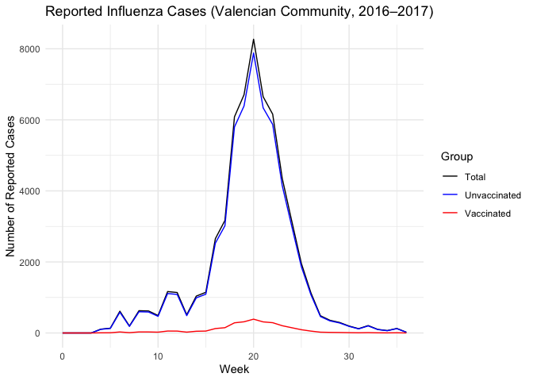
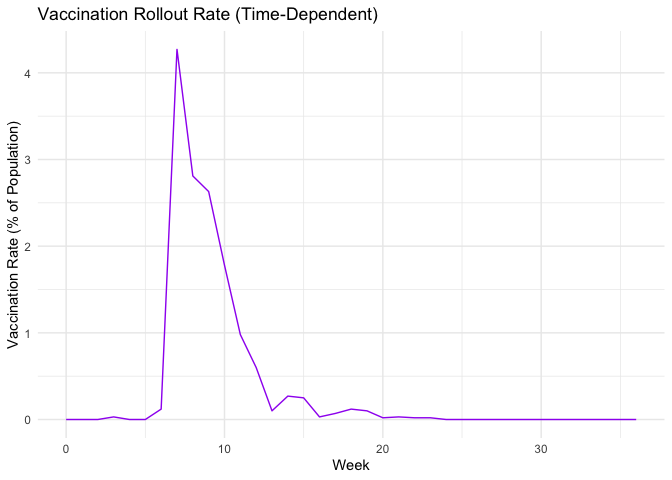
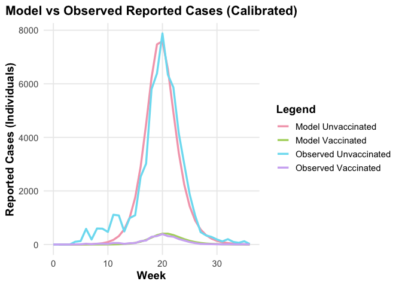
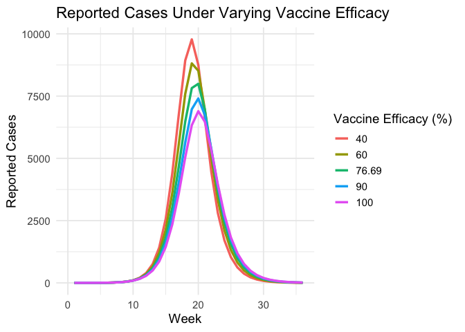
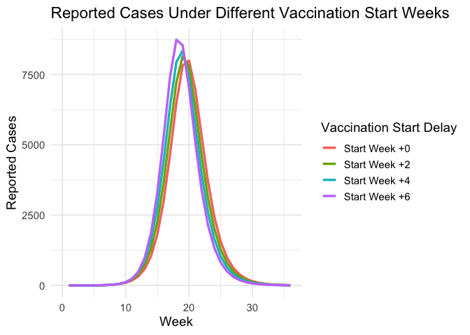

updated_coding_comments_revised
================
2025-05-04

\#—————————————————— \# 1. Load and Visualize Real-World Data from
Villaroig et al. \#——————————————————

``` r
# Load and complete data across 0-36 weeks
real_data = read_csv("modeling_data.csv") %>%
  complete(week = 0:36, fill = list(
    reported_cases = 0,
    unvaccinated_cases = 0,
    vaccinated_cases = 0,
    vaccination_rate = 0
  ))
```

    ## Rows: 37 Columns: 6
    ## ── Column specification ────────────────────────────────────────────────────────
    ## Delimiter: ","
    ## dbl (6): week, incidence, reported_cases, unvaccinated_cases, vaccinated_cas...
    ## 
    ## ℹ Use `spec()` to retrieve the full column specification for this data.
    ## ℹ Specify the column types or set `show_col_types = FALSE` to quiet this message.

``` r
# Plot reported case time series by group
ggplot(real_data, aes(x = week)) +
  geom_line(aes(y = reported_cases, color = "Total")) +
  geom_line(aes(y = unvaccinated_cases, color = "Unvaccinated")) +
  geom_line(aes(y = vaccinated_cases, color = "Vaccinated")) +
  labs(title = "Reported Influenza Cases (Valencian Community, 2016–2017)",
       x = "Week", y = "Number of Reported Cases", color = "Group") +
  scale_color_manual(values = c("Total" = "black", "Unvaccinated" = "blue", "Vaccinated" = "red")) +
  theme_minimal()
```

<!-- -->

``` r
# Plot weekly vaccination rate
ggplot(real_data, aes(x = week, y = vaccination_rate)) +
  geom_line(color = "purple") +
  labs(title = "Vaccination Rollout Rate (Time-Dependent)",
       x = "Week", y = "Vaccination Rate (% of Population)") +
  theme_minimal()
```

<!-- -->

\#—————————————————— \# 2. Define Parameters and Vaccination Function
\#——————————————————

``` r
# Core SEIR parameters
N = 4959968                   # Total population
beta = 9.1357                # Infection rate
lambda = 3.5                 # Latency rate (1/incubation time)
gamma = 1                    # Recovery rate
report_rate = 0.0702         # Reporting probability

# Define simulation time
times = seq(0, 36, by = 1)

# Time-dependent vaccination rate (converted to proportion)
d_vector = real_data$vaccination_rate / 100

# Interpolation function for d(t) – allows dynamic vaccine rollout
# This is a deviation from Villaroig to reflect real-world vaccine implementation
# Learned from class discussions

d_func = approxfun(x = times, y = d_vector, rule = 2)
```

\#—————————————————— \# 3. SEIR Model (Corrected: Uses 1 Initial
Infectious Individual) \#——————————————————

``` r
# Corrected model using Villaroig's assumptions:
# Iu(0) = 1; Iv(0) = 0; Lu(0) = 1/3 to reflect a short incubation period
# Ru(0) = 77.11% recovered (calibrated value from theta*)

seir_model = function(t, state, parameters) {
  with(as.list(c(state, parameters)), {
    
    I_total = Iu + Iv

    dSu = -beta * Su * I_total / N - d_func(t) * Su
    dSv = -a_v * beta * Sv * I_total / N + d_func(t) * Su
    dLu = beta * Su * I_total / N - lambda * Lu
    dLv = a_v * beta * Sv * I_total / N - lambda * Lv
    dIu = lambda * Lu - gamma * Iu
    dIv = lambda * Lv - gamma * Iv
    dRu = gamma * Iu - d_func(t) * Ru
    dRv = gamma * Iv + d_func(t) * Ru
    dCumIncU = lambda * Lu
    dCumIncV = lambda * Lv

    return(list(c(dSu, dSv, dLu, dLv, dIu, dIv, dRu, dRv, dCumIncU, dCumIncV)))
  })
}
```

\#—————————————————— \# 4. Initial Conditions Using Villaroig Section
2.4.1 \#——————————————————

``` r
# Initial conditions from theta* configuration
R0_prop = 0.7711  # Initial recovered proportion
R0 = R0_prop * N

init = c(
  Su = N - 1 - (1/3) - R0,  # Susceptible unvaccinated
  Sv = 0,
  Lu = 1/3, Lv = 0,
  Iu = 1, Iv = 0,
  Ru = R0, Rv = 0,
  CumIncU = 0, CumIncV = 0
)
```

\#—————————————————— \# 5. Solve ODE System with theta\* Parameters
\#——————————————————

``` r
# Run model using published values from Villaroig (theta*)
out = ode(y = init, times = times, func = seir_model,
          parms = list(beta = beta, a_v = 0.2331))
out_df = as.data.frame(out)

# Add week column for merging and plotting
out_df = out_df %>%
  mutate(week = time,
         new_inf_unvacc = c(NA, diff(CumIncU)),
         new_inf_vacc = c(NA, diff(CumIncV)),
         reported_unvacc = new_inf_unvacc * report_rate,
         reported_vacc = new_inf_vacc * report_rate)
```

\#—————————————————— \# 5.5. Merge Model Output with Real Data
\#——————————————————

``` r
plot_df = real_data %>%
  left_join(out_df, by = "week")
```

\#—————————————————— \# 6. Compare Model vs Real Observed Data
\#——————————————————

``` r
ggplot(plot_df, aes(x = week)) +
  geom_line(aes(y = reported_unvacc, color = "Model Unvaccinated"), size = 1.2) +
  geom_line(aes(y = reported_vacc, color = "Model Vaccinated"), size = 1.2) +
  geom_line(aes(y = unvaccinated_cases, color = "Observed Unvaccinated"), size = 1.2) +
  geom_line(aes(y = vaccinated_cases, color = "Observed Vaccinated"), size = 1.2) +
  labs(
    title = "Model vs Observed Reported Cases (Calibrated)",
    x = "Week",
    y = "Reported Cases (Individuals)",
    color = "Legend"
  ) +
  scale_color_manual(values = c(
    "Model Unvaccinated" = "#F4A7B9",   # soft pink
    "Model Vaccinated" = "#B0D56F",     # light green
    "Observed Unvaccinated" = "#7BDFF2",# light teal-blue
    "Observed Vaccinated" = "#D1B3F3"   # light lavender
  )) +
  theme_minimal(base_size = 14) +
  theme(
    plot.title = element_text(face = "bold", size = 16, hjust = 0.5),
    legend.title = element_text(face = "bold"),
    legend.position = "right",
    axis.title = element_text(face = "bold"),
    panel.grid.minor = element_blank()
  )
```

    ## Warning: Using `size` aesthetic for lines was deprecated in ggplot2 3.4.0.
    ## ℹ Please use `linewidth` instead.
    ## This warning is displayed once every 8 hours.
    ## Call `lifecycle::last_lifecycle_warnings()` to see where this warning was
    ## generated.

    ## Warning: Removed 1 row containing missing values or values outside the scale range
    ## (`geom_line()`).
    ## Removed 1 row containing missing values or values outside the scale range
    ## (`geom_line()`).

<!-- -->

\#—————————————————— \# Scenario 1: Simulate Effects of Varying Vaccine
Efficacy (VE) \#—————————————————— \# Description: Simulates the
epidemic under different vaccine efficacy levels \# using the SEIR
model. Results show how VE alters peak size and timing.

``` r
# Define VE levels to test
ve_scenarios = c(0.4, 0.6, 0.7669, 0.9, 1.0)

# Empty list to collect outputs
ve_outputs = list()

# Loop over each VE level
for (ve in ve_scenarios) {
  out = ode(y = init, times = times, func = seir_model,
            parms = list(beta = beta, a_v = 1 - ve))  # attenuation = 1 - VE
  out_df = as.data.frame(out) %>%
    mutate(week = time,
           new_cases = c(NA, diff(CumIncU + CumIncV)),
           reported = new_cases * report_rate,
           VE = ve * 100)
  ve_outputs[[as.character(ve)]] = out_df
}

# Combine all VE outputs
ve_combined_df = bind_rows(ve_outputs)

# Plot results
ggplot(ve_combined_df, aes(x = week, y = reported, color = as.factor(VE))) +
  geom_line(size = 1.2) +
  labs(title = "Reported Cases Under Varying Vaccine Efficacy",
       x = "Week", y = "Reported Cases",
       color = "Vaccine Efficacy (%)") +
  theme_minimal(base_size = 14)
```

    ## Warning: Removed 5 rows containing missing values or values outside the scale range
    ## (`geom_line()`).

<!-- -->

\#—————————————————— \# Scenario 2: Simulate Effects of Different
Vaccination Start Weeks \#—————————————————— \# Description: Shifts the
vaccine rollout curve by N weeks and assesses impact \# on epidemic
outcomes. Vaccination rate values are shifted forward.

``` r
# Define different start delays in weeks
start_week_delays = c(0, 2, 4, 6)

# Store all simulation outputs
start_outputs = list()

# Loop through delay scenarios
for (delay in start_week_delays) {
  # Shift the vaccination curve
  d_vector_shifted = c(rep(0, delay), head(d_vector, length(d_vector) - delay))
  d_func_shifted = approxfun(x = times, y = d_vector_shifted, rule = 2)
  
  # Run model with shifted vaccination
  out = ode(y = init, times = times, func = function(t, state, parameters) {
    with(as.list(c(state, parameters)), {
      I_total = Iu + Iv
      dSu = -beta * Su * I_total / N - d_func_shifted(t) * Su
      dSv = -a_v * beta * Sv * I_total / N + d_func_shifted(t) * Su
      dLu = beta * Su * I_total / N - lambda * Lu
      dLv = a_v * beta * Sv * I_total / N - lambda * Lv
      dIu = lambda * Lu - gamma * Iu
      dIv = lambda * Lv - gamma * Iv
      dRu = gamma * Iu - d_func_shifted(t) * Ru
      dRv = gamma * Iv + d_func_shifted(t) * Ru
      dCumIncU = lambda * Lu
      dCumIncV = lambda * Lv
      return(list(c(dSu, dSv, dLu, dLv, dIu, dIv, dRu, dRv, dCumIncU, dCumIncV)))
    })
  }, parms = list(beta = beta, a_v = 0.2331))
  
  out_df = as.data.frame(out) %>%
    mutate(week = time,
           new_cases = c(NA, diff(CumIncU + CumIncV)),
           reported = new_cases * report_rate,
           Delay = paste0("Start Week +", delay))
  
  start_outputs[[as.character(delay)]] = out_df
}

# Combine and plot
start_combined_df = bind_rows(start_outputs)

ggplot(start_combined_df, aes(x = week, y = reported, color = Delay)) +
  geom_line(size = 1.2) +
  labs(title = "Reported Cases Under Different Vaccination Start Weeks",
       x = "Week", y = "Reported Cases",
       color = "Vaccination Start Delay") +
  theme_minimal(base_size = 14)
```

    ## Warning: Removed 4 rows containing missing values or values outside the scale range
    ## (`geom_line()`).

<!-- -->
