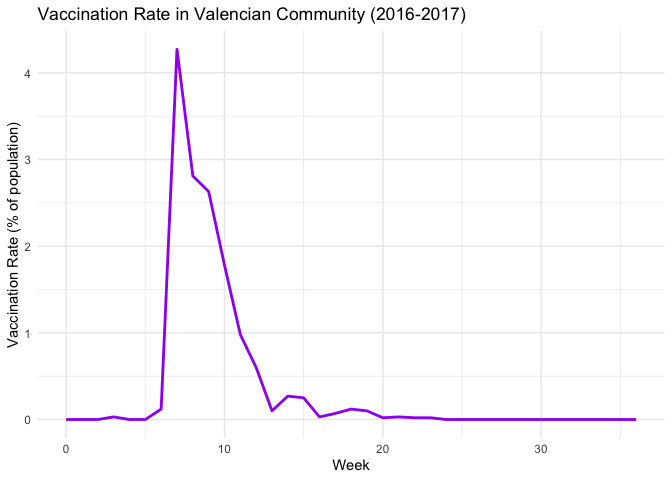
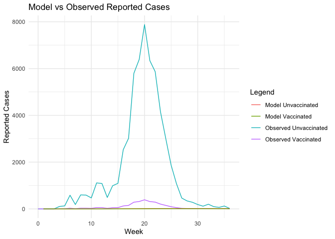

data_410
================
2025-04-02

\#——————————————————

1.  Visualize Real Data \#——————————————————

``` r
# Plot reported cases by group
ggplot(real_data, aes(x = week)) +
  geom_line(aes(y = reported_cases, color = "Total")) +
  geom_line(aes(y = unvaccinated_cases, color = "Unvaccinated")) +
  geom_line(aes(y = vaccinated_cases, color = "Vaccinated")) +
  labs(title = "Reported Influenza Cases in Valencian Community (2016-2017)",
       x = "Week", y = "Number of Cases", color = "Population") +
  theme_minimal() +
  scale_color_manual(values = c("Total" = "black", "Unvaccinated" = "blue", "Vaccinated" = "red"))
```

<!-- -->

``` r
# Plot vaccination rate
ggplot(real_data, aes(x = week, y = vaccination_rate)) +
  geom_line(color = "purple", size = 1) +
  labs(title = "Vaccination Rate in Valencian Community (2016-2017)",
       x = "Week", y = "Vaccination Rate (% of population)") +
  theme_minimal()
```

    ## Warning: Using `size` aesthetic for lines was deprecated in ggplot2 3.4.0.
    ## ℹ Please use `linewidth` instead.
    ## This warning is displayed once every 8 hours.
    ## Call `lifecycle::last_lifecycle_warnings()` to see where this warning was
    ## generated.

<!-- -->

\#——————————————————

2.  SEIR Model Definition (Fixed with Week 3 Seeding)
    \#——————————————————

``` r
# SEIR model with infection seeding at week 3
seir_model <- function(t, state, parameters) {
  with(as.list(c(state, parameters)), {

    # Inject infections at week 3 only
    if (t >= 3 & t < 3.1) {
      Iu <- Iu + 10
      Lu <- Lu + 20
      Su <- Su - 30
    }

    N <- Su + Sv + Lu + Lv + Iu + Iv + Ru + Rv
    Itotal <- Iu + Iv
    d <- ifelse(t >= vax_start & t <= vax_end, d_val, 0)

    dSu <- -b * Su * Itotal / N - d * Su
    dSv <- -av * b * Sv * Itotal / N + d * Su
    dLu <- b * Su * Itotal / N - l * Lu
    dLv <- av * b * Sv * Itotal / N - l * Lv
    dIu <- l * Lu - g * Iu
    dIv <- l * Lv - g * Iv
    dRu <- g * Iu - d * Ru
    dRv <- g * Iv + d * Ru
    dCumInciU <- l * Lu
    dCumInciV <- l * Lv

    return(list(c(dSu, dSv, dLu, dLv, dIu, dIv, dRu, dRv,
                  dCumInciU, dCumInciV)))
  })
}
```

\#——————————————————

3.  Base Model Implementation \#——————————————————

``` r
# Simulation timeline
times <- seq(0, 36, by = 1/7)

# Parameters from the paper
parameters <- c(
  b = 9.1357,
  av = 0.2331,
  l = 3.5,
  g = 1,
  d_val = 0.05,
  vax_start = 3,
  vax_end = 25
)

# Vaccination rate function d(t) from real data
d_vector <- real_data$vaccination_rate / 100
d_func <- approxfun(x = 0:36, y = d_vector, rule = 2)

# Population and initial state
N <- 4959968
R0_percent <- 0.7711
Ru0 <- R0_percent * N
Rv0 <- 0
Iu0 <- 0
Iv0 <- 0
Lu0 <- 0
Lv0 <- 0
Su0 <- N - (Iu0 + Iv0 + Lu0 + Lv0 + Ru0 + Rv0)
Sv0 <- 0

state <- c(Su = Su0, Sv = Sv0, Lu = Lu0, Lv = Lv0,
           Iu = Iu0, Iv = Iv0, Ru = Ru0, Rv = Rv0,
           CumInciU = 0, CumInciV = 0)

# Solve the model
out <- ode(y = state, times = times, func = seir_model, parms = parameters)
out_df <- as.data.frame(out)
```

\#——————————————————

4.  Process Outputs & Summarize \#——————————————————

``` r
# Calculate weekly incidence
out_df <- out_df %>%
  mutate(week = floor(time),
         new_cases_u = c(NA, diff(CumInciU)),
         new_cases_v = c(NA, diff(CumInciV)),
         Iu_reported = new_cases_u * 0.0702,
         Iv_reported = new_cases_v * 0.0702,
         I_total_reported = Iu_reported + Iv_reported)

# Take only weekly points
weekly_df <- out_df %>%
  filter(abs(time %% 1) < 1e-5)  # t = 0, 1, 2, ...

# Vaccine Efficacy
vaccine_efficacy <- (1 - parameters["av"]) * 100
cat("Vaccine Efficacy (VE):", vaccine_efficacy, "%\n")
```

    ## Vaccine Efficacy (VE): 76.69 %

``` r
# Final epidemic size
final_infected <- (tail(out_df$Ru, 1) + tail(out_df$Rv, 1)) - (Ru0 + Rv0)
final_infected_percent <- final_infected / N * 100
cat("Final epidemic size:", round(final_infected_percent, 2), "% of population\n")
```

    ## Final epidemic size: 0.66 % of population

``` r
# Peak infections
peak_infected <- max(out_df$Iu + out_df$Iv)
peak_week <- out_df$time[which.max(out_df$Iu + out_df$Iv)]
cat("Peak infected:", round(peak_infected), "at week", round(peak_week), "\n")
```

    ## Peak infected: 1774 at week 26

\#——————————————————

5.  Compare Model vs Real Data \#——————————————————

``` r
# Merge weekly model outputs with real data
compare_df <- real_data %>%
  left_join(weekly_df, by = "week")

ggplot(compare_df, aes(x = week)) +
  geom_line(aes(y = unvaccinated_cases, color = "Observed Unvaccinated")) +
  geom_line(aes(y = vaccinated_cases, color = "Observed Vaccinated")) +
  geom_line(aes(y = Iu_reported, color = "Model Unvaccinated")) +
  geom_line(aes(y = Iv_reported, color = "Model Vaccinated")) +
  labs(title = "Model vs Observed Reported Cases",
       x = "Week", y = "Reported Cases", color = "Legend") +
  theme_minimal()
```

    ## Warning: Removed 1 row containing missing values or values outside the scale range
    ## (`geom_line()`).
    ## Removed 1 row containing missing values or values outside the scale range
    ## (`geom_line()`).

<!-- -->
