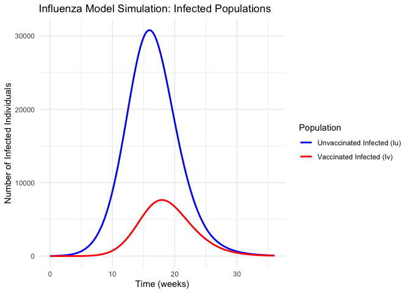
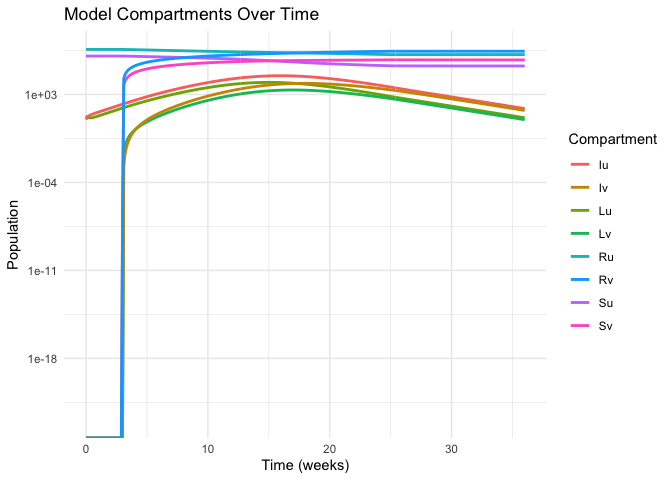
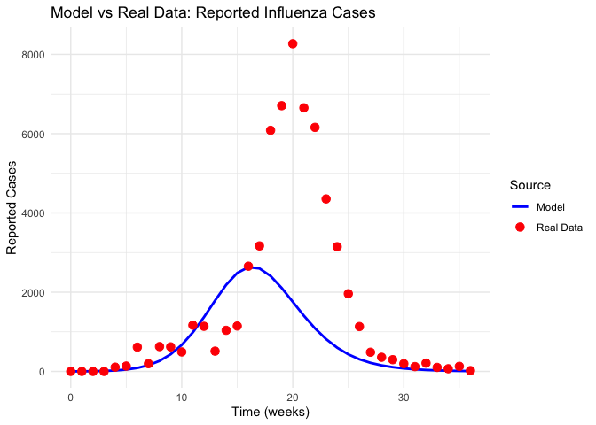
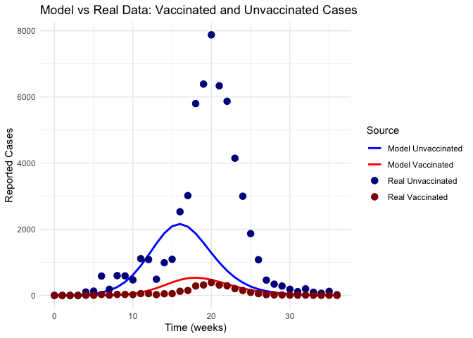
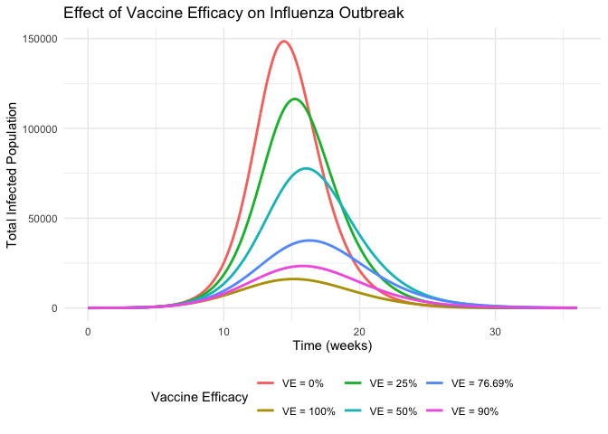
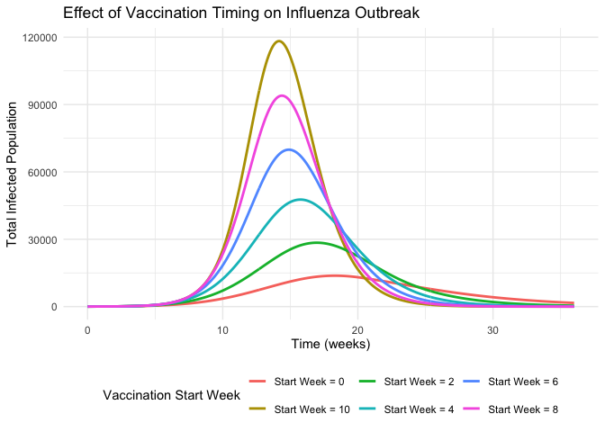

data_410
================
2025-04-02

\#—————————————————— \# 1. Model Definition \#——————————————————

    ## 'data.frame':    37 obs. of  6 variables:
    ##  $ week              : int  0 1 2 3 4 5 6 7 8 9 ...
    ##  $ incidence         : num  0 0 0 0 2.17 ...
    ##  $ reported_cases    : num  0 0 0 0 108 ...
    ##  $ unvaccinated_cases: num  0 0 0 0 103 ...
    ##  $ vaccinated_cases  : num  0 0 0 0 5.06 ...
    ##  $ vaccination_rate  : num  0 0 0 0.03 0 0 0.12 4.27 2.81 2.63 ...

    ##   week incidence reported_cases unvaccinated_cases vaccinated_cases
    ## 1    0      0.00           0.00               0.00             0.00
    ## 2    1      0.00           0.00               0.00             0.00
    ## 3    2      0.00           0.00               0.00             0.00
    ## 4    3      0.00           0.00               0.00             0.00
    ## 5    4      2.17         107.63             102.57             5.06
    ## 6    5      2.72         134.91             128.57             6.35
    ##   vaccination_rate
    ## 1             0.00
    ## 2             0.00
    ## 3             0.00
    ## 4             0.03
    ## 5             0.00
    ## 6             0.00

    ##       week      incidence      reported_cases   unvaccinated_cases
    ##  Min.   : 0   Min.   :  0.00   Min.   :   0.0   Min.   :   0.0    
    ##  1st Qu.: 9   1st Qu.:  2.58   1st Qu.: 128.0   1st Qu.: 122.0    
    ##  Median :18   Median : 10.33   Median : 512.4   Median : 488.3    
    ##  Mean   :18   Mean   : 32.73   Mean   :1623.2   Mean   :1546.9    
    ##  3rd Qu.:27   3rd Qu.: 39.54   3rd Qu.:1961.2   3rd Qu.:1868.9    
    ##  Max.   :36   Max.   :166.71   Max.   :8268.8   Max.   :7879.9    
    ##  vaccinated_cases vaccination_rate
    ##  Min.   :  0.00   Min.   :0.0000  
    ##  1st Qu.:  6.02   1st Qu.:0.0000  
    ##  Median : 24.10   Median :0.0200  
    ##  Mean   : 76.35   Mean   :0.3851  
    ##  3rd Qu.: 92.24   3rd Qu.:0.1200  
    ##  Max.   :388.91   Max.   :4.2700

<!-- --><!-- -->
\#—————————————————— \# 2. Base Model Implementation with Calibrated
Parameters \#——————————————————

\#—————————————————— \# 3. Model Visualization \#——————————————————
<!-- --><!-- --><!-- --><!-- -->

    ## R-squared for model fit: 0.1822328 
    ## R-squared for unvaccinated cases: 0.06229401 
    ## R-squared for vaccinated cases: -0.4870468

\#—————————————————— \# 5. Analysis of Vaccine Efficacy Scenarios
\#——————————————————
<!-- -->

    ##   Efficacy Final_Infected_Percent Peak_Infected Peak_Week
    ## 1     0.00              18.769555     148480.90      14.4
    ## 2    25.00              17.014919     116360.89      15.2
    ## 3    50.00              13.664436      77705.19      16.1
    ## 4    76.69               7.860029      37602.70      16.3
    ## 5    90.00               5.020627      23385.73      15.8
    ## 6   100.00               3.421505      16123.41      15.1
    ##   Final_Vaccinated_Percent
    ## 1                 66.28992
    ## 2                 66.30804
    ## 3                 66.35261
    ## 4                 66.46123
    ## 5                 66.53147
    ## 6                 66.57877

<!-- -->

    ##   Vaccination_Rate_Percent Final_Infected_Percent Peak_Infected Peak_Week
    ## 1                        1              16.768115    120768.395      14.9
    ## 2                        3              12.411323     72795.951      15.8
    ## 3                        5               7.860029     37602.697      16.3
    ## 4                        7               4.105708     17225.438      15.9
    ## 5                       10               1.425770      5959.889      13.8
    ##   Final_Vaccinated_Percent
    ## 1                 19.56194
    ## 2                 48.00123
    ## 3                 66.46123
    ## 4                 78.42364
    ## 5                 88.87718

<!-- -->

    ##   Start_Week Final_Infected_Percent Peak_Infected Peak_Week
    ## 1          0               4.236843      13773.56      18.3
    ## 2          2               6.618410      28454.73      17.0
    ## 3          4               9.156207      47668.16      15.7
    ## 4          6              11.532756      69905.34      14.9
    ## 5          8              13.661151      93963.74      14.4
    ## 6         10              15.527086     118266.46      14.2
    ##   Final_Vaccinated_Percent
    ## 1                 63.12022
    ## 2                 63.00424
    ## 3                 62.90299
    ## 4                 62.84366
    ## 5                 62.81005
    ## 6                 62.80015

    ## Theoretical risk ratio (1/av): 4.290004

    ## 
    ## Risk Ratio Analysis:

    ## Proportion infected among unvaccinated: 0.8376612

    ## Proportion infected among vaccinated: 0.8298098

    ## Risk of infection for unvaccinated vs vaccinated: 1.009462 times higher

    ## Paper mentions this ratio is approximately 5 times higher

    ## 
    ## Summary of Findings:

    ## 1. Vaccine Efficacy (VE) in the model: 76.69 %

    ##    (Paper calibrated value: 76.7%)

    ## 2. Final epidemic size with this efficacy: 7.860029 % of population

    ##    (Paper constraint: between 5-15%)

    ## 3. Risk ratio (unvaccinated vs vaccinated): 1.009462

    ##    (Paper finding: approximately 5 times higher)

    ## 4. Peak infected population: 37602.7 individuals at week 16.3

    ## 5. Reporting rate: 0.0702 or approximately 1 reported case per 14.24501 actual cases

    ## 6. Initial recovered population: 77.11 % (from paper's calibration)

    ## 
    ## Model Parameters Summary:

    ## Beta (infection rate): 9.1357

    ## Vaccine attenuation factor: 0.2331

    ## Vaccine efficacy: 76.69 %

    ## Latency rate: 3.5 per week

    ## Recovery rate: 1 per week

    ## Vaccination rate: 0.05 per week

    ## Reporting rate (k): 0.0702

    ## 
    ## Vaccination Strategy Analysis:

    ## 1. Higher vaccine efficacy significantly reduces both peak and final epidemic size

    ## 2. Earlier vaccination timing provides better protection at the population level

    ## 3. Higher vaccination rates lead to greater reductions in epidemic size

    ## 4. Realistic vaccine efficacy values (~77%) still provide substantial protection
