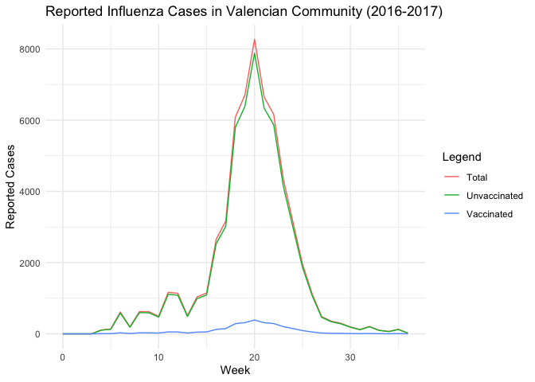
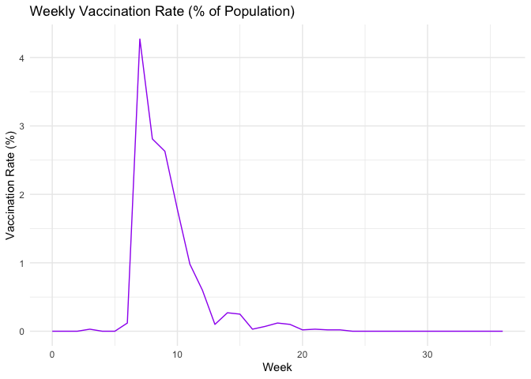
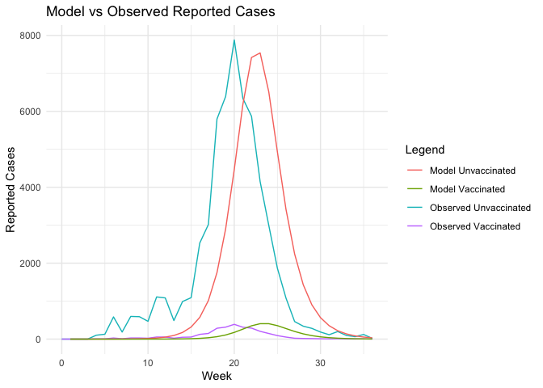
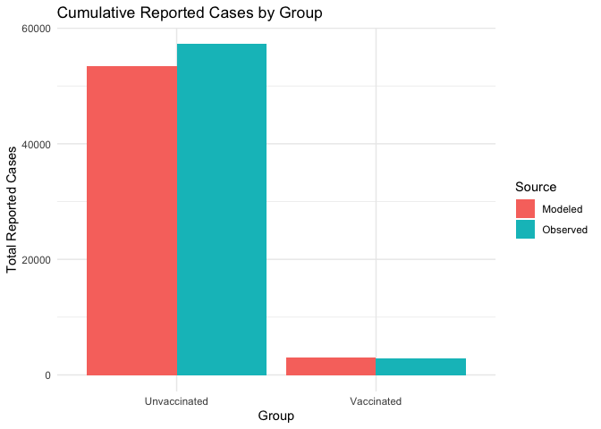
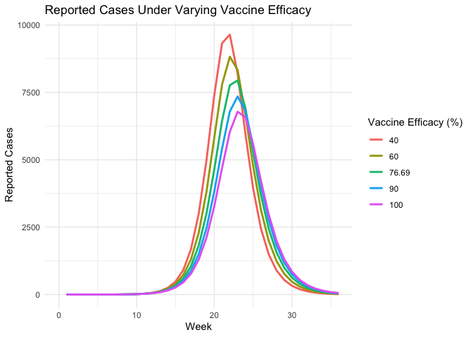
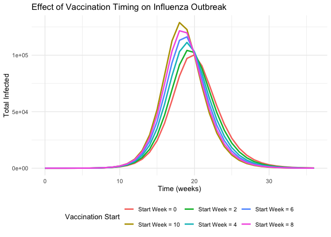

modeling_newcode
================
2025-05-01

\#——————————————————

1.  Visualize Real Data \#——————————————————

``` r
# Load the real data
real_data = read_csv("modeling_data.csv")
```

    ## Rows: 37 Columns: 6
    ## ── Column specification ────────────────────────────────────────────────────────
    ## Delimiter: ","
    ## dbl (6): week, incidence, reported_cases, unvaccinated_cases, vaccinated_cas...
    ## 
    ## ℹ Use `spec()` to retrieve the full column specification for this data.
    ## ℹ Specify the column types or set `show_col_types = FALSE` to quiet this message.

``` r
# Fill missing weeks (0–36) with 0s
real_data = real_data %>%
  complete(week = 0:36, fill = list(
    reported_cases = 0,
    unvaccinated_cases = 0,
    vaccinated_cases = 0,
    vaccination_rate = 0
  ))

# Plot reported cases
ggplot(real_data, aes(x = week)) +
  geom_line(aes(y = reported_cases, color = "Total")) +
  geom_line(aes(y = unvaccinated_cases, color = "Unvaccinated")) +
  geom_line(aes(y = vaccinated_cases, color = "Vaccinated")) +
  labs(title = "Reported Influenza Cases in Valencian Community (2016-2017)",
       x = "Week", y = "Reported Cases", color = "Legend") +
  theme_minimal()
```

<!-- -->

``` r
# Plot vaccination rate
ggplot(real_data, aes(x = week, y = vaccination_rate)) +
  geom_line(color = "purple") +
  labs(title = "Weekly Vaccination Rate (% of Population)",
       x = "Week", y = "Vaccination Rate (%)") +
  theme_minimal()
```

<!-- -->
\#——————————————————

2.  SEIR Model Definition (Fixed with Week 3 Seeding)
    \#——————————————————

``` r
# Parameters
N = 4959968
beta = 9.1357
a_v = 0.2331
lambda = 3.5
gamma = 1
report_rate = 0.0702

times = seq(0, 36, by = 1)

# Define vaccination function
d_vector = real_data$vaccination_rate / 100
d_func = approxfun(x = times, y = d_vector, rule = 2)

# Initial conditions
R0 = 0.7711 * N
init = c(
  Su = N - 0 - 0 - R0,
  Sv = 0,
  Lu = 0, Lv = 0,
  Iu = 0, Iv = 0,
  Ru = R0, Rv = 0,
  CumIncU = 0, CumIncV = 0
)

# SEIR function with week 3 seeding
seir_model = function(t, state, parameters) {
  with(as.list(c(state, parameters)), {
    if (t >= 3 & t < 3.1) {
      Iu = Iu + 10
      Lu = Lu + 20
      Su = Su - 30
    }

    I_total = Iu + Iv
    dSu = -beta * Su * I_total / N - d_func(t) * Su
    dSv = -a_v * beta * Sv * I_total / N + d_func(t) * Su
    dLu = beta * Su * I_total / N - lambda * Lu
    dLv = a_v * beta * Sv * I_total / N - lambda * Lv
    dIu = lambda * Lu - gamma * Iu
    dIv = lambda * Lv - gamma * Iv
    dRu = gamma * Iu - d_func(t) * Ru
    dRv = gamma * Iv + d_func(t) * Ru
    dCumIncU = lambda * Lu
    dCumIncV = lambda * Lv

    return(list(c(dSu, dSv, dLu, dLv, dIu, dIv, dRu, dRv, dCumIncU, dCumIncV)))
  })
}

# Run model
out = ode(y = init, times = times, func = seir_model, parms = NULL)
out_df = as.data.frame(out)
```

\#——————————————————

3.  Process Model Output \#——————————————————

``` r
# Compute new infections & reported cases
out_df = out_df %>%
  mutate(week = time,
         new_inf_unvacc = c(NA, diff(CumIncU)),
         new_inf_vacc = c(NA, diff(CumIncV))) %>%
  filter(!is.na(new_inf_unvacc)) %>%
  mutate(
    reported_unvacc = new_inf_unvacc * report_rate,
    reported_vacc = new_inf_vacc * report_rate
  )
```

\#——————————————————

4.  Summary Statistics \#——————————————————

``` r
# Vaccine Efficacy
VE = (1 - a_v) * 100
cat("Vaccine Efficacy (VE):", VE, "%\n")
```

    ## Vaccine Efficacy (VE): 76.69 %

``` r
# Final epidemic size
final_recovered = tail(out_df$Ru + out_df$Rv, 1)
initial_recovered = R0
final_infected = final_recovered - initial_recovered
final_infected_percent = final_infected / N * 100
cat("Final epidemic size:", round(final_infected_percent, 2), "% of population\n")
```

    ## Final epidemic size: 16.21 % of population

``` r
# Peak infections
out_df$I_total = out_df$Iu + out_df$Iv
peak_infected = max(out_df$I_total)
peak_week = out_df$week[which.max(out_df$I_total)]
cat("Peak infected:", round(peak_infected), "at week", peak_week, "\n")
```

    ## Peak infected: 107946 at week 23

\#——————————————————

5.  Compare Model vs Real Data \#——————————————————

``` r
plot_df = real_data %>%
  left_join(out_df, by = "week")

ggplot(plot_df, aes(x = week)) +
  geom_line(aes(y = unvaccinated_cases, color = "Observed Unvaccinated")) +
  geom_line(aes(y = vaccinated_cases, color = "Observed Vaccinated")) +
  geom_line(aes(y = reported_unvacc, color = "Model Unvaccinated")) +
  geom_line(aes(y = reported_vacc, color = "Model Vaccinated")) +
  labs(title = "Model vs Observed Reported Cases",
       x = "Week", y = "Reported Cases", color = "Legend") +
  theme_minimal()
```

    ## Warning: Removed 1 row containing missing values or values outside the scale range
    ## (`geom_line()`).
    ## Removed 1 row containing missing values or values outside the scale range
    ## (`geom_line()`).

<!-- -->
\#——————————————————

6.  Bar Plot: Cumulative Reported Cases by Group \#——————————————————

``` r
total_observed_unvacc = sum(plot_df$unvaccinated_cases, na.rm = TRUE)
total_observed_vacc = sum(plot_df$vaccinated_cases, na.rm = TRUE)
total_modeled_unvacc = sum(plot_df$reported_unvacc, na.rm = TRUE)
total_modeled_vacc = sum(plot_df$reported_vacc, na.rm = TRUE)

bar_data = data.frame(
  Group = rep(c("Unvaccinated", "Vaccinated"), 2),
  Source = c(rep("Observed", 2), rep("Modeled", 2)),
  Cases = c(total_observed_unvacc, total_observed_vacc,
            total_modeled_unvacc, total_modeled_vacc)
)

ggplot(bar_data, aes(x = Group, y = Cases, fill = Source)) +
  geom_bar(stat = "identity", position = "dodge") +
  labs(title = "Cumulative Reported Cases by Group",
       y = "Total Reported Cases") +
  theme_minimal()
```

<!-- -->

\#——————————————————

7.  Risk Ratio of Infection \#——————————————————

``` r
# Estimate total number vaccinated during the season
vaccinated_total = sum(d_vector[3:25] * N)  # from week 3 to 25 (inclusive)

# Risk group sizes
at_risk_unvacc = init["Su"]  # Susceptible unvaccinated at start
at_risk_vacc = vaccinated_total

# Infections
total_inf_unvacc = sum(out_df$new_inf_unvacc, na.rm = TRUE)
total_inf_vacc = sum(out_df$new_inf_vacc, na.rm = TRUE)

# Risk calculations
prop_inf_unvacc = total_inf_unvacc / at_risk_unvacc
prop_inf_vacc = total_inf_vacc / at_risk_vacc
risk_ratio = prop_inf_unvacc / prop_inf_vacc

cat("Final Proportion infected among unvaccinated:", round(prop_inf_unvacc, 4), "\n")
```

    ## Final Proportion infected among unvaccinated: 0.6705

``` r
cat("Final Proportion infected among vaccinated:", round(prop_inf_vacc, 4), "\n")
```

    ## Final Proportion infected among vaccinated: 0.0619

``` r
cat("Final Risk ratio (Unvaccinated vs Vaccinated):", round(risk_ratio, 4), "\n")
```

    ## Final Risk ratio (Unvaccinated vs Vaccinated): 10.8346

\#—————————————————— SCENARIO 1: Varying Vaccine Efficacy (VE)
\#——————————————————

``` r
# Define a range of attenuation factors (lower av = higher VE)
av_values = c(0.0, 0.1, 0.2331, 0.4, 0.6)  # VE from 100% to 40%

# Store outputs
scenario_results = list()

for (av in av_values) {
  # Modify model with current av
  seir_model_scenario = function(t, state, parameters) {
    with(as.list(c(state, parameters)), {
      if (t >= 3 & t < 3.1) {
        Iu = Iu + 10
        Lu = Lu + 20
        Su = Su - 30
      }
      I_total = Iu + Iv
      dSu = -beta * Su * I_total / N - d_func(t) * Su
      dSv = -av * beta * Sv * I_total / N + d_func(t) * Su
      dLu = beta * Su * I_total / N - lambda * Lu
      dLv = av * beta * Sv * I_total / N - lambda * Lv
      dIu = lambda * Lu - gamma * Iu
      dIv = lambda * Lv - gamma * Iv
      dRu = gamma * Iu - d_func(t) * Ru
      dRv = gamma * Iv + d_func(t) * Ru
      dCumIncU = lambda * Lu
      dCumIncV = lambda * Lv
      return(list(c(dSu, dSv, dLu, dLv, dIu, dIv, dRu, dRv, dCumIncU, dCumIncV)))
    })
  }

  # Reset state
  state = init

  # Run model
  out = ode(y = state, times = times, func = seir_model_scenario, parms = NULL)
  out_df = as.data.frame(out)
  out_df$week = out_df$time
  out_df$VE = (1 - av) * 100
  out_df$reported_total = c(NA, diff(out_df$CumIncU + out_df$CumIncV)) * report_rate
  scenario_results[[as.character(av)]] = out_df
}

# Combine results
all_results = bind_rows(scenario_results, .id = "scenario")

# Plot
ggplot(all_results, aes(x = week, y = reported_total, color = factor(VE))) +
  geom_line(size = 1) +
  labs(title = "Reported Cases Under Varying Vaccine Efficacy",
       x = "Week", y = "Reported Cases", color = "Vaccine Efficacy (%)") +
  theme_minimal()
```

    ## Warning: Using `size` aesthetic for lines was deprecated in ggplot2 3.4.0.
    ## ℹ Please use `linewidth` instead.
    ## This warning is displayed once every 8 hours.
    ## Call `lifecycle::last_lifecycle_warnings()` to see where this warning was
    ## generated.

    ## Warning: Removed 5 rows containing missing values or values outside the scale range
    ## (`geom_line()`).

<!-- -->

\#——————————————————

SCENARIO 2: Varying Vaccination Start Week \#——————————————————

``` r
# Define function to run one scenario
run_simulation = function(av, vax_rate, vax_start, vax_end) {
  
  # Define time-specific vaccination function
  d_func_scenario = approxfun(
    x = times,
    y = ifelse(times >= vax_start & times <= vax_end, vax_rate, 0),
    rule = 2
  )
  
  # SEIR model with capped vaccination and infection seeding at t=0
  seir_model_timing = function(t, state, parameters) {
    with(as.list(c(state, parameters)), {
      
      # Infection seeding at week 0
      if (t >= 0 & t < 0.1) {
        Iu = Iu + 10
        Lu = Lu + 20
        Su = Su - 30
      }

      I_total = Iu + Iv
      d = d_func_scenario(t)

      # Cap vaccination to 60% of population
      total_vaccinated = Sv + Lv + Iv + Rv
      if (total_vaccinated >= 0.6 * N) {
        d = 0
      }

      dSu = -beta * Su * I_total / N - d * Su
      dSv = -av * beta * Sv * I_total / N + d * Su
      dLu = beta * Su * I_total / N - lambda * Lu
      dLv = av * beta * Sv * I_total / N - lambda * Lv
      dIu = lambda * Lu - gamma * Iu
      dIv = lambda * Lv - gamma * Iv
      dRu = gamma * Iu - d * Ru
      dRv = gamma * Iv + d * Ru
      dCumIncU = lambda * Lu
      dCumIncV = lambda * Lv

      return(list(c(dSu, dSv, dLu, dLv, dIu, dIv, dRu, dRv,
                    dCumIncU, dCumIncV)))
    })
  }

  # Reset state
  state = init

  # Solve ODE
  out = ode(y = state, times = times, func = seir_model_timing, parms = NULL)
  out_df = as.data.frame(out)

  # Process results
  out_df = out_df %>%
    mutate(
      time = time,
      week = time,
      I_total = Iu + Iv,
      reported_total = c(0, diff(CumIncU + CumIncV)) * report_rate,
      V_total = Sv + Lv + Iv + Rv
    )

  # Summary statistics
  final_infected = tail(out_df$Ru + out_df$Rv, 1) - R0
  final_infected_percent = max(final_infected / N * 100, 0)
  peak_infected = max(out_df$I_total, na.rm = TRUE)
  peak_week = out_df$time[which.max(out_df$I_total)]
  final_vaccinated = tail(out_df$V_total, 1)
  final_vaccinated_percent = max(final_vaccinated / N * 100, 0)

  return(list(
    out_df = out_df,
    final_infected_percent = final_infected_percent,
    peak_infected = peak_infected,
    peak_week = peak_week,
    final_vaccinated_percent = final_vaccinated_percent
  ))
}

#------------------------------------------------------
# Run simulations for different vaccination start times
#------------------------------------------------------

start_weeks = c(0, 2, 4, 6, 8, 10)
av = 0.2331  # paper's attenuation factor
vax_rate = 0.01  # reduced vaccination rate per week

timing_results = list()
for (i in seq_along(start_weeks)) {
  timing_results[[i]] = run_simulation(av, vax_rate, start_weeks[i], start_weeks[i] + 20)
}

#------------------------------------------------------
# Prepare data for plotting
#------------------------------------------------------

plot_data_timing = data.frame()
for (i in seq_along(start_weeks)) {
  temp_df = timing_results[[i]]$out_df
  temp_df$start_week = start_weeks[i]
  temp_df$scenario = paste0("Start Week = ", start_weeks[i])
  plot_data_timing = rbind(plot_data_timing,
                           temp_df[, c("time", "I_total", "start_week", "scenario")])
}

# Plot total infections over time
p_timing = ggplot(plot_data_timing, aes(x = time, y = I_total, color = scenario)) +
  geom_line(size = 1) +
  labs(
    title = "Effect of Vaccination Timing on Influenza Outbreak",
    x = "Time (weeks)", y = "Total Infected",
    color = "Vaccination Start"
  ) +
  theme_minimal() +
  theme(legend.position = "bottom")

print(p_timing)
```

<!-- -->

``` r
#------------------------------------------------------
# Create summary table
#------------------------------------------------------

timing_summary = data.frame(
  Start_Week = start_weeks,
  Final_Infected_Percent = sapply(timing_results, function(x) max(x$final_infected_percent, 0)),
  Peak_Infected = sapply(timing_results, function(x) max(x$peak_infected, 0)),
  Peak_Week = sapply(timing_results, function(x) max(x$peak_week, 0)),
  Final_Vaccinated_Percent = sapply(timing_results, function(x) max(x$final_vaccinated_percent, 0))
)

print(timing_summary)
```

    ##   Start_Week Final_Infected_Percent Peak_Infected Peak_Week
    ## 1          0               15.50098      100299.0        20
    ## 2          2               15.74554      104228.9        19
    ## 3          4               16.13942      111302.7        19
    ## 4          6               16.54105      116229.9        19
    ## 5          8               16.93717      121627.5        18
    ## 6         10               17.32407      128894.4        18
    ##   Final_Vaccinated_Percent
    ## 1                 18.42631
    ## 2                 18.78888
    ## 3                 18.76596
    ## 4                 18.75672
    ## 5                 18.75276
    ## 6                 18.75071
